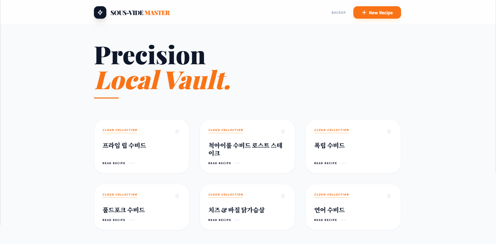
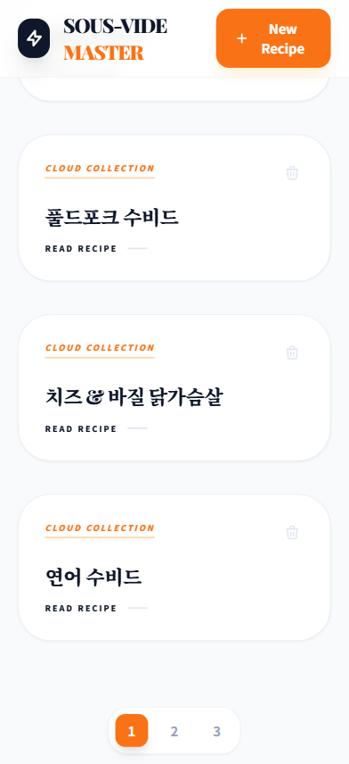

# 🥩 Sous-vide Master (수비드 마스터)

> **"Precision Local Vault."**
> <br>분자요리학을 기반으로 한 나만의 정밀 수비드 레시피 저장소입니다.


<br>

## 📖 프로젝트 소개
**Sous-vide Master**는 수비드(Sous-vide) 조리법을 체계적으로 관리하고 기록하기 위한 웹 애플리케이션입니다.
과학적 근거(온도, 시간, 살균 기준)를 바탕으로 작성된 레시피를 **카드 형태의 아름다운 UI**로 제공하며, PC와 모바일 어디서든 최적화된 환경에서 레시피를 열람할 수 있습니다.

[👉 데모 페이지 바로가기](https://jbseojb.github.io/sous-vide/) *(Settings > Pages에서 배포 URL이 활성화되면 여기에 링크를 넣으세요)*

<br>

## ✨ 주요 기능

### 1. 🧪 과학적 레시피 관리 (Precision Cooking)
- 단순한 조리법이 아닌 **정확한 온도(℃)**와 **시간**을 기록합니다.
- 재료별 시즈닝, 마이야르 반응, 아로제(Arroser) 등 전문적인 팁을 구조화된 HTML로 저장합니다.

### 2. 📱 완벽한 반응형 디자인 (Responsive UI)
- **Mobile First:** 아이폰, 갤럭시 등 모바일 환경에서도 깨짐 없는 카드 뷰를 제공합니다.
- **Glassmorphism:** 최신 트렌드인 글래스모피즘 디자인과 부드러운 애니메이션을 적용했습니다.
- **Smart Layout:** 화면 크기에 따라 그리드와 모달의 레이아웃이 유동적으로 최적화됩니다.

### 3. ☁️ Firebase 클라우드 동기화
- **Firestore DB:** 작성한 레시피는 실시간으로 클라우드에 저장되어 데이터 유실 걱정이 없습니다.
- **Anonymous Auth:** 복잡한 가입 절차 없이 익명 인증을 통해 즉시 나만의 저장소를 가질 수 있습니다.

<br>

## 🛠 사용 기술 (Tech Stack)

* **Frontend:** HTML5, JavaScript (ES6+)
* **Styling:** [Tailwind CSS](https://tailwindcss.com/) (CDN)
* **Backend / DB:** [Google Firebase](https://firebase.google.com/) (Authentication, Firestore)
* **Fonts:** Noto Sans KR, Playfair Display

<br>

## 📂 프로젝트 구조
```bash
sous-vide/
├── index.html       # 메인 애플리케이션 (SPA 구조)
├── README.md        # 프로젝트 문서
└── .idea/           # IDE 설정 파일

```

## 🚀 시작하기 (Getting Started)

이 프로젝트는 별도의 빌드 과정 없이 정적 파일로 실행 가능합니다.

1. **리포지토리 클론**
```bash
git clone [https://github.com/jbseojb/sous-vide.git](https://github.com/jbseojb/sous-vide.git)

```


2. **실행**
* `index.html` 파일을 브라우저에서 직접 열거나, Live Server 등을 통해 실행합니다.
* 또는 GitHub Settings > Pages에서 `main` 브랜치를 선택하여 무료로 호스팅할 수 있습니다.


## 📸 스크린샷

| PC 메인 화면 | 모바일 상세 화면 |
| --- | --- |
|  |  |
| 카드 그리드 뷰 | 반응형 레시피 모달 |